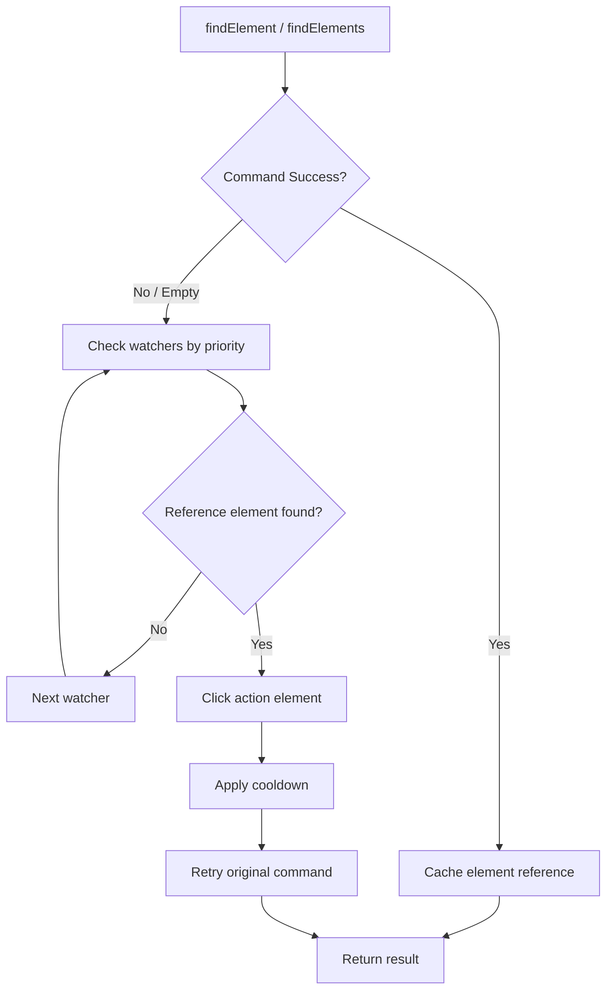
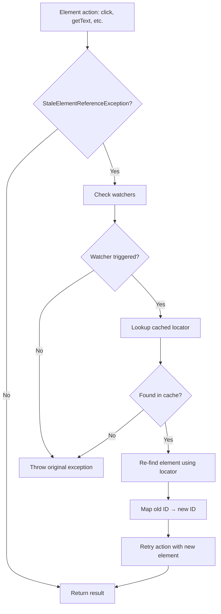

# Appium UI Watchers Plugin

[](https://opensource.org/licenses/MIT)
[](https://appium.io/)
[](https://nodejs.org/)
[](https://www.npmjs.com/package/appium-uiwatchers-plugin)
[](https://github.com/rajvinodh/appium-uiwatchers-plugin/actions)

## Introduction

Mobile apps often display unexpected UI elements — cookie consent dialogs, permission prompts, rating popups—that break test automation. Traditional approaches require explicit waits or try-catch blocks scattered throughout test code.

This plugin provides a centralized, declarative way to handle these interruptions automatically.

## Features

- **Zero Wait Overhead** — No waiting for UI elements that may never appear
- **Centralized Management** — Register watchers once, apply across entire session
- **Priority-Based Execution** — Higher priority watchers are checked first
- **Cooldown Support** — Wait for stable UI after dismissing an element
- **Auto-Expiry** — Watchers automatically expire after specified duration
- **One-Shot or Continuous** — Stop after first trigger or keep watching
- **Transparent Interception** — Handles on findElement, findElements, and element actions automatically
- **Session-Scoped** — Each session maintains its own independent set of watchers

## Installation

### From npm (coming soon)

```bash
appium plugin install appium-uiwatchers-plugin
```

### From local source

```bash
appium plugin install --source=local /path/to/appium-uiwatchers-plugin
```

### Verify installation

```bash
appium plugin list
```

You should see `uiwatchers` in the installed plugins list.

### Activate the plugin

```bash
appium --use-plugins=uiwatchers
```

## Quick Start

> **Note:** Ensure Appium server is started with `--use-plugins=uiwatchers`

**JavaScript**

```javascript
// Register a watcher for cookie consent
await driver.execute('mobile: registerUIWatcher', {
  name: 'cookie-consent',
  referenceLocator: { using: 'id', value: 'com.app:id/cookie_banner' },
  actionLocator: { using: 'id', value: 'com.app:id/accept_button' },
});

// Run tests - watchers trigger automatically on findElement/findElements
await driver.findElement('id', 'com.app:id/login_button');
```

**Java**

```java
// Register a watcher for cookie consent
Map<String, Object> watcherParams = new HashMap<>();
watcherParams.put("name", "cookie-consent");
watcherParams.put("referenceLocator", Map.of("using", "id", "value", "com.app:id/cookie_banner"));
watcherParams.put("actionLocator", Map.of("using", "id", "value", "com.app:id/accept_button"));

driver.executeScript("mobile: registerUIWatcher", watcherParams);

// Run tests - watchers trigger automatically on findElement/findElements
driver.findElement(By.id("com.app:id/login_button"));
```

## API Reference

### mobile: registerUIWatcher

Registers a new UI watcher for automatic element handling.

**Parameters**

| Parameter        | Type    | Required | Default | Description                              |
| ---------------- | ------- | -------- | ------- | ---------------------------------------- |
| name             | string  | Yes      | -       | Unique watcher identifier                |
| referenceLocator | object  | Yes      | -       | Element to detect (trigger condition)    |
| actionLocator    | object  | Yes      | -       | Element to click when triggered          |
| duration         | number  | Yes      | -       | Auto-expiry time in ms (max: 60000)      |
| priority         | number  | No       | 0       | Execution order (higher = first)         |
| stopOnFound      | boolean | No       | false   | Deactivate after first trigger           |
| cooldownMs       | number  | No       | 0       | Wait time after action before re-trigger |

**Locator Object**

| Property | Type   | Description                                       |
| -------- | ------ | ------------------------------------------------- |
| using    | string | Strategy: `id`, `xpath`, `accessibility id`, etc. |
| value    | string | Locator value                                     |

**Example**

```json
{
  "name": "cookie-consent",
  "priority": 10,
  "referenceLocator": {
    "using": "id",
    "value": "com.app:id/cookie_banner"
  },
  "actionLocator": {
    "using": "id",
    "value": "com.app:id/accept_button"
  },
  "duration": 60000,
  "stopOnFound": false,
  "cooldownMs": 5000
}
```

**Response**

```json
{
  "success": true,
  "watcher": {
    "name": "cookie-consent",
    "priority": 10,
    "registeredAt": 1704067200000,
    "expiresAt": 1704067260000,
    "status": "active"
  }
}
```

### mobile: unregisterUIWatcher

Removes a registered watcher by name.

**Parameters**

| Parameter | Type   | Required | Description                   |
| --------- | ------ | -------- | ----------------------------- |
| name      | string | Yes      | Name of the watcher to remove |

**Example**

```json
{
  "name": "cookie-consent"
}
```

**Response**

```json
{
  "success": true,
  "removed": "cookie-consent"
}
```

### mobile: listUIWatchers

Returns all registered watchers with their current state.

**Parameters**

None.

**Response**

```json
{
  "success": true,
  "watchers": [
    {
      "name": "cookie-consent",
      "priority": 10,
      "referenceLocator": { "using": "id", "value": "com.app:id/cookie_banner" },
      "actionLocator": { "using": "id", "value": "com.app:id/accept_button" },
      "duration": 60000,
      "stopOnFound": false,
      "cooldownMs": 5000,
      "registeredAt": 1704067200000,
      "expiresAt": 1704067260000,
      "status": "active",
      "triggerCount": 2,
      "lastTriggeredAt": 1704067230000
    }
  ],
  "totalCount": 1
}
```

### mobile: clearAllUIWatchers

Removes all registered watchers for the current session.

**Parameters**

None.

**Response**

```json
{
  "success": true,
  "removedCount": 3
}
```

### mobile: enableUIWatchers

Enables watcher checking (enabled by default).

**Parameters**

None.

**Response**

```json
{
  "success": true,
  "message": "UI Watchers enabled"
}
```

### mobile: disableUIWatchers

Temporarily disables watcher checking without removing watchers.

**Parameters**

None.

**Response**

```json
{
  "success": true,
  "message": "UI Watchers disabled"
}
```

## Configuration

Plugin behavior can be customized via CLI options when starting Appium server.

| Option                                | Type    | Range       | Default | Description                       |
| ------------------------------------- | ------- | ----------- | ------- | --------------------------------- |
| --plugin-uiwatchers-max-watchers      | integer | 1-20        | 5       | Maximum watchers per session      |
| --plugin-uiwatchers-max-duration-ms   | integer | 1000-600000 | 60000   | Maximum watcher duration in ms    |
| --plugin-uiwatchers-max-cache-entries | integer | 10-200      | 50      | Maximum cached element references |
| --plugin-uiwatchers-element-ttl-ms    | integer | 5000-300000 | 60000   | Cache entry TTL in ms             |

**Example**

```bash
appium --use-plugins=uiwatchers \
  --plugin-uiwatchers-max-watchers=10 \
  --plugin-uiwatchers-max-duration-ms=120000 \
  --plugin-uiwatchers-max-cache-entries=100 \
  --plugin-uiwatchers-element-ttl-ms=30000
```

## How It Works

### Watcher Checking Flow



### Stale Element Recovery Flow



## Development

### Prerequisites

- Node.js 18+
- Appium 3.x

### Setup

```bash
# Clone the repository
git clone https://github.com/rajvinodh/appium-uiwatchers-plugin.git
cd appium-uiwatchers-plugin

# Install dependencies
npm install

# Build
npm run build
```

### Scripts

| Script                  | Description                        |
| ----------------------- | ---------------------------------- |
| `npm run build`         | Compile TypeScript to JavaScript   |
| `npm run test`          | Run all tests (unit + integration) |
| `npm run test:unit`     | Run unit tests only                |
| `npm run test:coverage` | Run tests with coverage report     |
| `npm run lint`          | Run ESLint and Prettier checks     |
| `npm run lint:fix`      | Auto-fix linting issues            |

### Project Structure

```
├── src/                  # TypeScript source code
│   ├── plugin.ts         # Main plugin class
│   ├── watcher-store.ts  # Watcher state management
│   ├── watcher-checker.ts# Watcher execution logic
│   ├── element-cache.ts  # Element reference caching
│   ├── commands/         # Command implementations
│   ├── config.ts         # Configuration defaults
│   ├── types.ts          # Type definitions
│   └── utils.ts          # Utility functions
├── test/
│   ├── unit/             # Unit tests
│   └── integration/      # Integration tests
└── lib/                  # Compiled output
```

### Contributing

1. Fork the repository
2. Create a feature branch (`git checkout -b feature/my-feature`)
3. Make your changes
4. Run tests (`npm run test`)
5. Run linting (`npm run lint`)
6. Commit your changes
7. Push to your branch
8. Open a Pull Request
